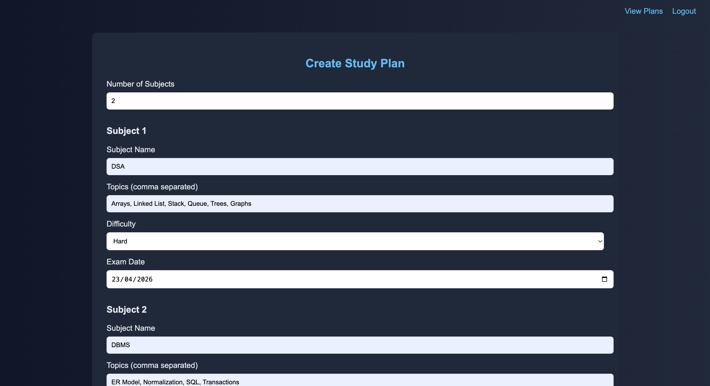
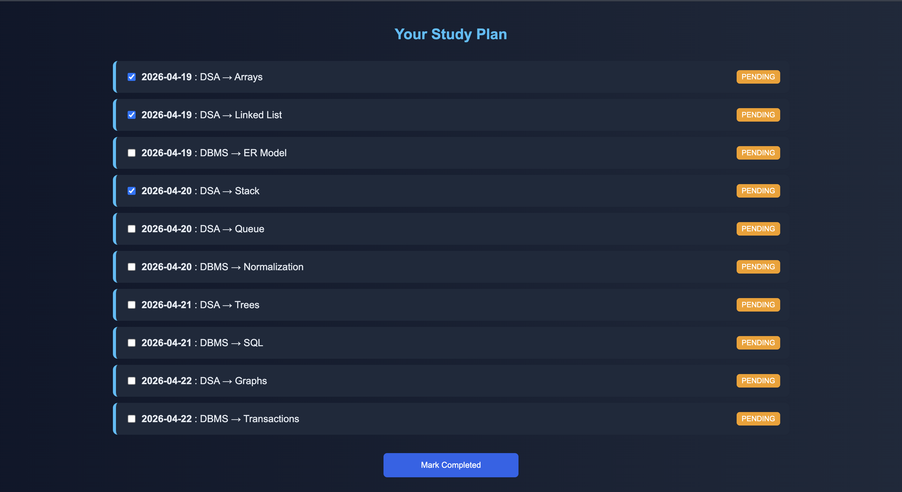
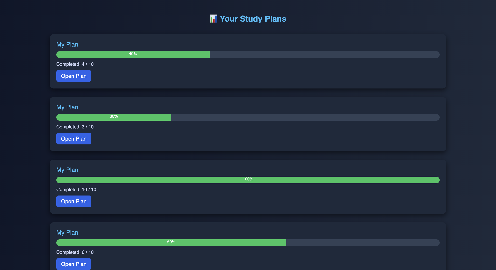

# 📚 ExamPrepPlanner – Smart Study Planner

A full-stack web application that helps students **generate optimized study plans**, **track progress**, and **manage multiple exam schedules efficiently**.

---

## 🚀 Features

### 🧠 Smart Study Plan Generation

* Automatically generates study schedules based on:

  * Subject difficulty (Easy / Medium / Hard)
  * Exam deadlines
  * Number of topics
* Ensures **even distribution of workload**

---

### 📋 Task Management

* Each topic is converted into a **trackable task**
* Tasks are scheduled **day-wise**
* Users can mark tasks as:

  * ✅ Completed
  * ⏳ Pending

---

### 📊 Progress Tracking

* Each plan has a **progress bar**
* Shows:

  * Completed tasks
  * Total tasks
  * Completion percentage

---

### 📁 Multi-Plan Support

* Users can create **multiple study plans**
* Each plan is stored separately
* Easy navigation between plans

---

### 🔐 User Authentication

* Login & session-based access
* Each user sees only their own plans

---

## 🏗️ Tech Stack

| Layer        | Technology     |
| ------------ | -------------- |
| Frontend     | HTML, CSS, JSP |
| Backend      | Java Servlets  |
| Database     | MySQL          |
| Server       | Apache Tomcat  |
| Architecture | MVC Pattern    |

---

## 🗄️ Database Schema

### 🔹 `plans`

* `id` (PK)
* `user_id`
* `plan_name`
* `created_at`

### 🔹 `tasks`

* `id` (PK)
* `plan_id` (FK)
* `subject`
* `topic`
* `task_date`
* `status` (PENDING / COMPLETED)

---

## 🔄 Application Flow

1. User logs in
2. Enters subjects, topics, difficulty, exam dates
3. Scheduler generates optimized plan
4. Plan is saved in database
5. User views all plans
6. Opens a plan → sees tasks
7. Marks tasks as completed
8. Progress bar updates dynamically

---

## 📸 Screenshots

### 🔹 1. Plan Creation Page



---

### 🔹 2. Generated Study Plan



---

### 🔹 3. Plans Dashboard (Progress View)



---

## ⚙️ How to Run

### 1️⃣ Clone the repository

```bash
git clone https://github.com/your-username/ExamPrepPlanner.git
```

---

### 2️⃣ Import into Eclipse

* File → Import → Existing Project
* Select project folder

---

### 3️⃣ Setup Database

Open MySQL and run:

```sql
CREATE DATABASE examprepplanner;
USE examprepplanner;

CREATE TABLE plans (
    id INT AUTO_INCREMENT PRIMARY KEY,
    user_id INT,
    plan_name VARCHAR(100),
    created_at TIMESTAMP DEFAULT CURRENT_TIMESTAMP
);

CREATE TABLE tasks (
    id INT AUTO_INCREMENT PRIMARY KEY,
    plan_id INT,
    subject VARCHAR(100),
    topic VARCHAR(255),
    task_date DATE,
    status VARCHAR(20) DEFAULT 'PENDING',
    FOREIGN KEY (plan_id) REFERENCES plans(id) ON DELETE CASCADE
);
```

---

### 4️⃣ Configure DB Connection

Update:

```java
DBConnection.java
```

```java
private static final String USER = "root";
private static final String PASSWORD = "your_password";
```

---

### 5️⃣ Run on Tomcat

* Right-click project → Run on Server
* Open:

```text
http://localhost:8080/ExamPrepPlanner
```

---

## 🧠 Key Concepts Used

* Greedy Scheduling Algorithm
* Priority Queue (based on deadline & difficulty)
* JDBC for database operations
* MVC Architecture
* Session Management

---

## 📌 Future Improvements

* 📅 Calendar view for tasks
* 📊 Graph-based analytics
* 🔔 Notifications & reminders
* ✏️ Edit/Delete plans
* 🧾 Custom plan naming

---

## 👨‍💻 Author

**Ashutosh Upreti**

---

## ⭐ If you like this project

Give it a ⭐ on GitHub!
